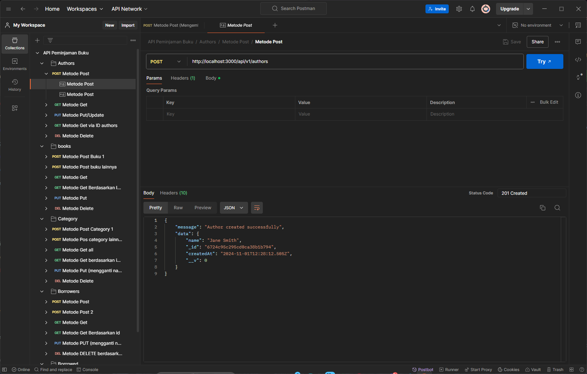

# 📚 Book Borrowing System API

An API built with Express.js and MongoDB to manage a book borrowing system. This project includes features for handling books, authors, categories, borrowers, and book borrowing transactions.



## ✨ Features

- **Books Management**: Add, update, and delete books.
- **Authors Management**: Add, update, and delete authors.
- **Categories Management**: Add, update, and delete book categories.
- **Borrowers Management**: Manage information about book borrowers.
- **Book Borrowing Transactions**: Borrow, return, and manage book borrowing records.

## 📂 Folder Structure
```bash
project/
├── node_modules/       # Contains installed npm dependencies
├── src/                # Main folder for source code
│   ├── config/                # Database and environment configurations
│   │   └── mongodb.js              # MongoDB connection configuration
│   │
│   ├── controllers/           # Logic for handling API routes
│   │   ├── bookController.js         # Controller for book logic
│   │   ├── authorController.js       # Controller for author logic
│   │   ├── categoryController.js     # Controller for category logic
│   │   ├── borrowerController.js     # Controller for borrower logic
│   │   └── borrowedBookController.js # Controller for borrowed book logic
│   │
│   ├── models/                # MongoDB schemas for data
│   │   ├── bookModel.js           # Schema for book data
│   │   ├── authorModel.js         # Schema for author data
│   │   ├── categoryModel.js       # Schema for category data
│   │   ├── borrowerModel.js       # Schema for borrower data
│   │   └── borrowedBookModel.js   # Schema for borrowed book data
│   │
│   ├── routes/                # Route definitions for each API endpoint
│   │   ├── bookRoutes.js         # Routes for book endpoints
│   │   ├── authorRoutes.js       # Routes for author endpoints
│   │   ├── categoryRoutes.js     # Routes for category endpoints
│   │   ├── borrowerRoutes.js     # Routes for borrower endpoints
│   │   └── borrowedBookRoutes.js # Routes for borrowed book endpoints
│   │
│   ├── middleware/            # Middleware for authentication, logging, etc.
│   │   └── Middleware.js       # Example authentication middleware
│   │
│   ├── .env                    # Environment configuration file (e.g., database URL)
│   └── app.js                  # Main application file setting up server and routes
│
├── .gitignore            # Ignores specific files/folders from Git tracking
├── nodemon.json          # Nodemon configuration for auto-restart in development
├── package-lock.json     # Dependency lock file to ensure consistent installs
├── package.json          # npm configuration file for dependencies and scripts
```

## 🚀 Getting Started

### Prerequisites

- Node.js (v14+ recommended)
- MongoDB (local or MongoDB Atlas)

### Installation

1. **Clone the repository:**
   ```bash
   git clone https://github.com/username/repo-name.git
   cd repo-name
2. **Install dependencies:**
   ```bash
   npm install
3. **Configure environment variables:
   Create a .env file in the root directory and add your MongoDB URI and other configuration as follows:**
   ```env
   MONGODB_URI=your_mongodb_connection_string   # Replace 'your_mongodb_connection_string' with your actual MongoDB URI
   PORT=3000                                    # Server port
4. **Run the server:**
   ```env
   npm start

## 📖 API Endpoints

### Books

- GET /books: Retrieve the list of books
- GET /book/:id: Retrieve details of a specific book
- POST /book: Add a new book
- PUT /book/:id: Update a book by ID
- DELETE /book/:id: Delete a book by ID
- POST /book/upload: Upload a book cover

### Authors

- GET /authors: Retrieve the list of authors
- GET /author/:id: Retrieve details of a specific author
- POST /author: Add a new author
- PUT /author/:id: Update an author by ID
- DELETE /author/:id: Delete an author by ID
- POST /author/upload: Upload an author's photo

### Categories

- GET /categories: Retrieve the list of categories
- GET /category/:id: Retrieve details of a specific category
- POST /category: Add a new category
- PUT /category/:id: Update a category by ID
- DELETE /category/:id: Delete a category by ID

### Borrowers

- GET /borrowers: Retrieve the list of borrowers
- GET /borrower/:id: Retrieve details of a specific borrower
- POST /borrower: Add a new borrower
- PUT /borrower/:id: Update a borrower by ID
- DELETE /borrower/:id: Delete a borrower by ID

### Borrowed Books

- POST /borrow/book: Add a new borrowed book entry
- GET /borrow/book/list: Retrieve the list of active borrowed books
- POST /borrow/book/return: Return a borrowed book

## 📬 Example Request (Postman)
**Here is an example JSON payload for borrowing a book:**
```bash
POST /api/v1/borrowed/books
{
  "bookId": "64f3781c77cf6efde6991d",
  "borrowerId": "64e24cb2b63e33c2562f0f",
  "expectedReturnedAt": "2024-11-15"
}
```

## 🛠️ Built With
- Express.js - Backend framework for Node.js
- MongoDB - NoSQL database
- Mongoose - ODM for MongoDB and Node.js

##🤝 Contributing
1. Fork the project
2. Create your feature branch (git checkout -b feature/new-feature)
3. Commit your changes (git commit -m 'Add new feature')
4. Push to the branch (git push origin feature/new-feature)
5. Open a pull request

## 📄 License
This project is licensed under the MIT License - see the LICENSE file for details.

## 📞 Contact
For any questions or feedback, feel free to reach out:
- GitHub: Fizm00/Firza Himawan
- Email: himawanfirza21@gmail.com
